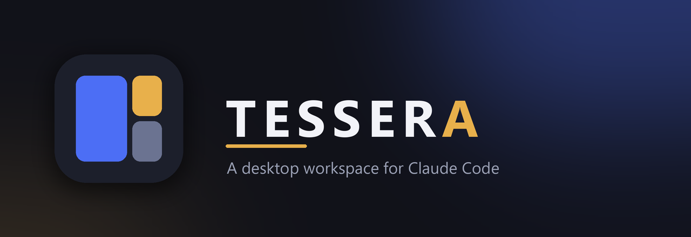

<div align="center">



<p>
  
  
  
  
  <a href="LICENSE"></a>
</p>

<strong>Run many Claude Code sessions side by side in a tiling mosaic —<br>each its own chat or terminal panel, all in one window.</strong>

</div>

---

**Tessera** wraps the [Claude Code](https://docs.anthropic.com/en/docs/claude-code) CLI in a native
desktop app. Every panel is a real `claude` session — full context, tools, and MCP — but instead of
a lone terminal you get a resizable mosaic of them: chat here, a terminal there, sessions that can
even message each other. Built with [Tauri 2](https://v2.tauri.app/) (Rust) + React 19.

> **Status:** beta. Actively developed; expect rough edges.

---

## Features

- **Tiled multi-session workspace** — open many Claude Code sessions at once. Focus a panel and it
  grows; the others yield space.
- **Chat _and_ terminal panels** — view any session as a rich chat (markdown, syntax highlighting,
  image paste) or as a raw xterm terminal running the TUI.
- **Panel groups & tabs** — collapse related panels into a tabbed group; maximize one to fill the
  area and reach the rest with `Ctrl+Tab` / `Ctrl+Shift+Tab`.
- **Panel-to-panel messaging** — an in-app MCP server lets one session list the other open panels
  and message them (delegate, ask a peer, hand off a result), fire-and-forget or awaiting a reply.
- **`cgui` command-line launcher** — run `cgui` in any directory to open a new tab rooted there,
  like `code .`; if the app is already running it just adds a tab.
- **Session management** — resume past conversations, browse history, and attach external
  `claude --resume` sessions by folder drop or paste.
- **Bring-your-own API** — talk to the Anthropic API directly in a panel alongside your CLI sessions.
- **MCP server manager** — add and toggle MCP servers; they're wired into new panels automatically.
- **Permission-aware** — permission prompts, plan mode, and per-panel permission modes surface as
  in-app cards.
- **Usage dashboard, workspaces & plugins** — token analytics, save/reload whole layouts, and small
  built-in tools (notepad, timer).

---

## Requirements

- **[Claude Code CLI](https://docs.anthropic.com/en/docs/claude-code)** installed and on your `PATH`
  (or at `~/.local/bin`). Tessera spawns `claude` for every session — it won't work without it.
- **[Node.js](https://nodejs.org/)** 18+ and npm.
- **[Rust](https://www.rust-lang.org/tools/install)** (stable) with the
  [Tauri 2 prerequisites](https://v2.tauri.app/start/prerequisites/) for your OS.
- **Windows:** GNU `windres` on `PATH` to compile app resources. With
  [MSYS2](https://www.msys2.org/), add `C:\msys64\mingw64\bin` to `PATH` before building.

---

## Getting started

```bash
npm install            # install frontend dependencies
npm run tauri dev      # run the app (hot-reloads the UI)
npm run tauri build    # optimized build + installer
```

Build output and the NSIS installer land under `src-tauri/target/release/`.

**Handy scripts (Windows):** `build_dev.bat` for a quick `cargo build`, and
`tools/promote-stable.ps1` to copy a release build to a stable install location and install the
`cgui` launcher into `~/.local/bin`.

---

## The `cgui` launcher

Once promoted, `cgui` behaves like `code .` for Tessera:

```bash
cd path/to/project
cgui            # open a new tab rooted here (launches the app if needed)
cgui subdir     # open ./subdir
cgui C:\path    # open that path
```

If the app is already open, the directory is forwarded to the running window as a new tab instead of
starting a second copy.

---

## Project structure

```
src/                      React + TypeScript frontend
  components/             UI: chat, terminal, dialogs, settings, analytics, ...
  store/                  zustand stores (instances, layout, chat, settings, ...)
  lib/                    bridges to Rust, session/workspace logic, panel bus
  engine/                 layout / mosaic engine
src-tauri/                Rust backend (Tauri)
  src/stream/             Claude Code stream-json process management
  src/pty/                terminal (PTY) sessions
  src/panelbus/           in-app MCP server for panel-to-panel messaging
  src/sessions/           session files, history, usage parsing
  src/llm/                direct Anthropic API provider
  src/db/                 local SQLite storage
tools/                    cgui launcher + release/promote scripts
```

---

## Data & privacy

- App data (local SQLite DB, generated MCP config, the bundled plugin) lives in `~/.tessera/`.
- API keys entered in **Settings → LLM Providers** are stored in the OS keychain via the system
  keyring — never in the repo or plaintext config.
- Product analytics are **off unless an analytics key is supplied at runtime**; none is bundled here.

---

## Trademark

Not affiliated with, endorsed by, or sponsored by Anthropic. "Claude" and "Claude Code" are
trademarks of Anthropic. Tessera is an independent, unofficial desktop client for the Claude Code CLI.

---

## License

[MIT](LICENSE) © Ahmet Deniz Yılmaz
